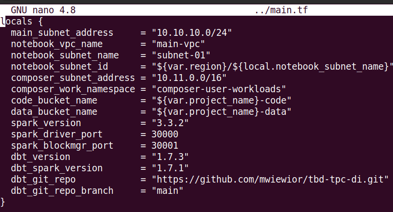

IMPORTANT ❗ ❗ ❗ Please remember to destroy all the resources after each work session. You can recreate infrastructure by creating new PR and merging it to master.
  

1. ✅ Authors:

   ***Group nr 9***

   ***https://github.com/NastyaRush/tbd-workshop-1/tree/master***
   
2. ✅ Follow all steps in README.md. (except 8, 9, 10, 11 because they are duplicates from this instruction)

3. ✅ Select your project and set budget alerts on 5%, 25%, 50%, 80% of 50$ (in cloud console -> billing -> budget & alerts -> create buget; unclick discounts and promotions&others while creating budget).

  

5. ✅ From avaialble Github Actions select and run destroy on main branch.
   
6. ✅ Create new git branch and:
    1. Modify tasks-phase1.md file.
    
    2. Create PR from this branch to **YOUR** master and merge it to make new release. 
    
    

7. ✅ Analyze terraform code. Play with terraform plan, terraform graph to investigate different modules.

   Selected module: Vertex AI

   
   The Vertex AI module depicted in the Terraform graph provisions resources for managing AI and machine learning workflows in Google Cloud Platform. It includes resources such as Google Notebooks instances, storage buckets, IAM bindings, and project services. Dependencies are established between resources, and variables are utilized for configuration. The module sets up a Notebook instance and associated storage within the specified project and region, leveraging the Google Cloud provider from the Terraform registry.
   
    
   
8. ✅ Reach YARN UI
   
   Command used for setting up the tunnel:

   gcloud compute --project "tbd-2024l-309014" ssh --zone "europe-west1-d" "tbd-cluster-m" -- -L 8088:localhost:8088

   
   
9. Draw an architecture diagram (e.g. in draw.io) that includes:
    1. VPC topology with service assignment to subnets
   
       
       
    2. Description of the components of service accounts
  
       131121272765-compute@developer.gserviceaccount.com (iac): This service account, identified as "iac," facilitates the integration between GitHub and Google Cloud services. It plays a crucial role in managing access tokens and ensuring smooth communication between the two platforms.
   
       
       tbd-2024l-309014-data@tbd-2024l-309014.iam.gserviceaccount.com: Referred to as "tbd-composer-sa," this service account serves as the orchestrator for Cloud Composer environments, Dataproc clusters, and associated jobs. It is responsible for managing and coordinating data-related operations within the environment.
   
       
       tbd-2024l-309014-lab@tbd-2024l-309014.iam.gserviceaccount.com: Designated as "tbd-terraform," this service account is exclusively utilized for Terraform activities. It facilitates communication and management of the project infrastructure within Google Cloud from the Terraform perspective, ensuring smooth integration and governance of resources.

       
       
    4. List of buckets for disposal
       
       
    5. Description of network communication (ports, why it is necessary to specify the host for the driver) of Apache Spark running from Vertex AI Workbech
  
       
       
  
    ***place your diagram here***

10. ✅ Create a new PR and add costs by entering the expected consumption into Infracost

For all the resources of type: `google_artifact_registry`, `google_storage_bucket`, `google_service_networking_connection`
create a sample usage profiles and add it to the Infracost task in CI/CD pipeline. Usage file [example](https://github.com/infracost/infracost/blob/master/infracost-usage-example.yml) 

  Expected consumption:
   

  Infracost output:
   

11. Create a BigQuery dataset and an external table using SQL
    
    ***place the code and output here***
   
    ORC does not require a table schema, because in contrast to traditional relational databases that require a predefined schema, ORC can function with schema-on-read. It means that data is interpreted at the time of reading. ORC has a header containing metadata about columns so that the schema can be understood when reading. ORC is made this way to provide flexibility for Big Data systems like Hadoop.

  
12. ✅ Start an interactive session from Vertex AI workbench:
    
    
   
13. ✅ Find and correct the error in spark-job.py

    Command for running spark-job.py:
    gcloud dataproc jobs submit pyspark gs://tbd-2024l-309014-code/spark-job.py --cluster=tbd-cluster --region=europe-west1 --project "tbd-2024l-309014"

    It’s output:
    

    Error: "code" : 404, "message" : "The specified bucket does not exist."
    How to find what causes error: analize responce

    Correction:
    

    Result after correction:
    
    

14. Additional tasks using Terraform:

    1. Add support for arbitrary machine types and worker nodes for a Dataproc cluster and JupyterLab instance

    ***place the link to the modified file and inserted terraform code***
    
    3. Add support for preemptible/spot instances in a Dataproc cluster

    ***place the link to the modified file and inserted terraform code***
    
    3. Perform additional hardening of Jupyterlab environment, i.e. disable sudo access and enable secure boot
    
    ***place the link to the modified file and inserted terraform code***

    4. (Optional) Get access to Apache Spark WebUI

    ***place the link to the modified file and inserted terraform code***
